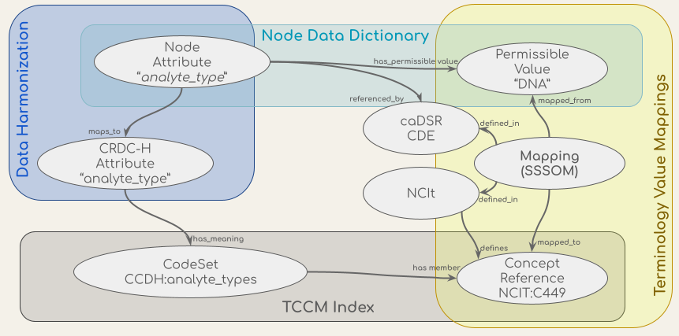
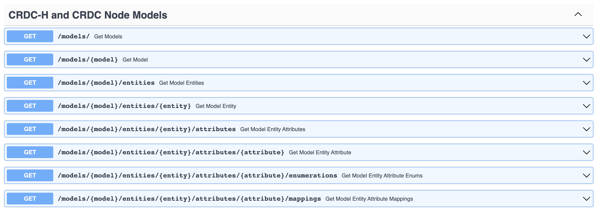
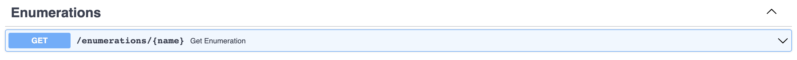
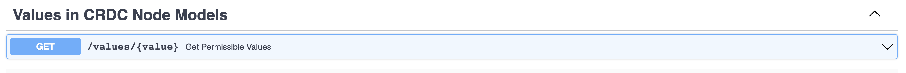
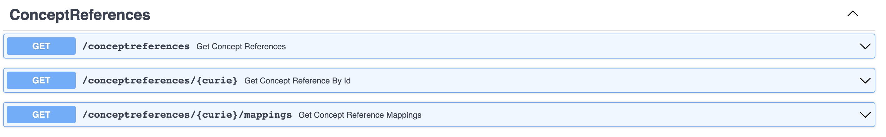

# Terminology services API

The CCDH terminology service is a RESTful API - an architectural style for an application program interface (API) 
that uses HTTP requests to access and use data - which supports the validation, lookup, binding, and mapping of the 
concepts in the CCDH data harmonization process and the transformation and validation workflow. The API uses a 
conceptual graph model based on the ISO/IEC 11179-3, a metadata registries metamodel of the International Organization 
for Standardization (ISO)’s technical committee on data management and interchange. The CCDH terminology service API 
integrates sources of model definitions, permissible values, concepts, and mappings, which are shown in the figure 
below. These sources include concept codes from the NCI Thesaurus (NCIt), the data dictionaries of metadata models 
such as the Genomics ([GDC](https://docs.gdc.cancer.gov/Data_Dictionary/viewer/)) and Proteomics 
([PDC](https://pdc.cancer.gov/data-dictionary/dictionary.html#:~:text=The%20PDC%20data%20dictionary%20is,origin%2C%20usage%2C%20and%20format.)) 
Data Commons data dictionaries, the CCDH Harmonized model ([CRDC-H](https://github.com/cancerDHC/ccdhmodel)), 
the mappings of attributes from the CRDC Data Repositories' (data nodes) models to the CRDC-H model, and the mappings 
of values in their data dictionaries to NCIt concept codes from 
[NCIt EVS](https://ncit.nci.nih.gov/ncitbrowser/pages/mapping_search.jsf?nav_type=mappings&b=0&m=0) and 
[caDSR](https://wiki.nci.nih.gov/pages/viewpage.action?pageId=309494141&sortBy=name&sortOrder=ascending).


Figure: Conceptual models (ovals) of the data in the CCDH Terminology Service and their sources (the shaded boxes).

The endpoints in the RESTful service provide ways to navigate and retrieve this information. The API is built on top of 
the OpenAPI standard (OAS) and an [OAS 3 spec](<rest_service_root>/openapi.json) is available for automated 
creation and exploration of the API capabilities with OAS-compatible toolings. 
[The OAS API Documentation UI](<rest_service_root>/docs) could be used to explore and test the endpoints. All source code of the 
service and technical documentations are on GitHub at [https://github.com/cancerDHC/ccdh-terminology-service](https://github.com/cancerDHC/ccdh-terminology-service).

## Endpoints

### models

The models endpoints are used to navigate the entities and attributes in the models that are imported into the service.



You can use the steps in the endpoint to traverse all the attributes in the service. To start, list all the models:
(Replace <rest_service_root> with the actual root of the service.)

```shell
curl -X 'GET' '<rest_service_root>/models/' -H 'accept: application/json'
```

List all the entities in a model: 

```shell
curl -X 'GET' '<rest_service_root>/models/CRDC-H/entities' -H 'accept: application/json'
```

List all the attributes of an entity in a model: 

```shell
curl -X 'GET' '<rest_service_root>/models/CRDC-H/entities/Specimen/attributes' -H 'accept: application/json'
```

There are also URLs reserved for describing the models, entities and attributes in the future. In version 0.1.0 they are just 
placeholders with only the name of the elements. For example, this will display more information about a model
in the future. 

```shell
curl -X 'GET' '<rest_service_root>/models/CRDC-H' -H 'accept: application/json'
```

To list the identifiers of the enumerations of an attribute: 

```shell
curl -X 'GET' \
  '<rest_service_root>/models/CRDC-H/entities/Specimen/attributes/analyte_type/enumerations' \
  -H 'accept: application/json'
```

To retrieve all mappings from the enumerated values of an attribute in the node data dictionaries, or mappings to 
concepts in the CRDC-H model, use the mappings endpoint of an attribute. The service can return either JSON or YAML
format of [the Simple Standard for Sharing Ontology Mappings(SSSOM) spec](https://github.com/mapping-commons/SSSOM).

```shell
curl -X 'GET' \
  '<rest_service_root>/models/CRDC-H/entities/Specimen/attributes/analyte_type/mappings' \
  -H 'accept: application/json'
```

Note: In release 0.1.0, the terminology service is only targeting the entities and attributes in the models that have
enumerated values or concept codes. It doesn't include any attribute that doesn't use enumerated values, for example,
attributes of numerical types, identifier, etc.

### Enumerations

This endpoint returns enumerations given an identifier. The identifier of the enumerations could be retrieved from the 
models endpoint at `models/{model}/entities/{entity}/attributes/{attribute}/enumerations`. 



The endpoint will return the enumerations in YAML format following the [LinkML EnumDefinition spec](https://linkml.github.io/linkml-model/docs/EnumDefinition/).

This endpoint is integrated into the LinkML geneartion step of the CCDH data harmonization workflow.

### Values

This endpoint serves retrieval of enumerated values in the data dictionaries of meatdata models from NCI. The spec
of this endpoint is still being modified and is expected to change in the next version of the service.



### ConceptReferences

This endpoint uses the TCCM ConceptReference spec. It retrieves a concept code (in the current release, all concept codes are from NCIT). 



The CCDH terminology service added a mappings URL to retrieve the mappings to an NCIT code in the system. For example

```shell
curl -X 'GET' \
  '<rest_service_root>/conceptreferences/NCIT%3AC449/mappings' \
  -H 'accept: application/json'
```

The response can be in either JSON of YAML format of [the Simple Standard for Sharing Ontology Mappings(SSSOM) spec](https://github.com/mapping-commons/SSSOM).

